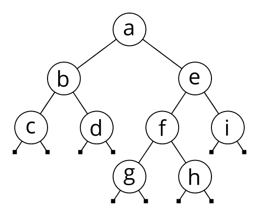

# acme-circular-containers [](https://hackage.haskell.org/package/acme-circular-containers)

Most immutable data structures have a spine, meaning that when you modify an element, only the nodes on the path from the root to the modified element need to be reallocated (see the Example section below for details). The data structures in this library are spineless, so all the nodes need to be reallocated.

## Acme

The Acme category is for joke packages, so as you might guess from that and from the paragraph above, spineless immutable data structures are rarely a good idea. Nevertheless, some serious packages do provide important spineless immutable data structures, such as [Arrays](http://hackage.haskell.org/package/array), for those few situations in which the read operations sufficiently outnumber the write operations that the improvement of reads from O(log n) to O(1) compensates for the deterioration of writes from O(log n) to O(n).

When I started to write this package, I initially though that the data structures I was implementing might offer the same kind of benefits in similarly-rare circumstances. However, it turns out that for each of them, there is already an existing standard data structure which has the same performance on the operations I support, and often also support fast updates. So this package really does deserve its Acme label, and should serve as a cautionary tale: yes, it is possible to implement immutable spineless data structures, but you probably shouldn't!

## Circular

Unlike Arrays, which are spineless because all the data is in a single node, the data structures in this package consist of several nodes. The nodes point at each other, giving you O(1) access to their neighbours, and those pointers are allowed to form cycles. This differs from spine-based data structures, in which parent nodes point to their child nodes but not vice-versa.

## Containers

The data structures provided by this package are circular versions of some of the data structure provided by the [containers](http://hackage.haskell.org/package/containers) package:

### Graph

A circular version of [`Data.Graph`](http://hackage.haskell.org/package/containers/docs/Data-Graph.html); or rather of [`Data.Graph.Wrapper`](http://hackage.haskell.org/package/graph-wrapper/docs/Data-Graph-Wrapper.html), a wrapper which associates data to the vertices.

Many beginners struggle to implement graphs in Haskell, because the obvious representation is to have each vertex point at their neighbours, but that representation is spineless, unlike every other data structure they are likely to have defined up to this point. The normal solution is to store the set of vertices and the set of edges separately, each in their own spine-based data structure, something like `Graph { vertices :: Set Int, edges :: Set (Int, Int) }`. Here, however, we do create one node per vertex, and each node does point to its vertex's neighbours.

#### Non-acme alternative

`Data.Graph` uses `0` to `n-1` to represent the `n` vertices of a graph, and an array of `n` lists of vertices to represent the neighbours of each vertex. As a result, it also has O(1) access to the list of neighbours of a vertex. My version associates a label of type `v` to each vertex, which `Data.Graph` doesn't support, but it's easy to define another array of `n` labels in order to get O(1) access to the label as well.

`Data.Graph.Wrapper` also associates a label of type `v` to each vertex, and does use an array of `n` labels to store them, but instead of using the indices from `0` to `n-1` to represent the vertices, it lets you use `n` distinct, not necessarily consecutive values of type `i`. As a result, `Data.Graph.Wrapper` requires an extra O(log n) step to convert an `i` into an array index.

### Sequence

A circular version of [`Data.Sequence`](http://hackage.haskell.org/package/containers/docs/Data-Sequence.html).

The imperative version of `Seq` would be a doubly-linked list: we can efficiently add and remove elements to both ends of the sequence, and we can efficiently concatenate two sequences, but we don't have easy access to the elements in the middle of the sequence, we have to walk to them one step at a time. Our circular version is literally a doubly-linked list; starting from either end, we can walk in either direction one step at a time, but of course we cannot efficiently make any modification. Unlike `Seq`, walking towards the middle elements doesn't peel off the outer elements, so from one of the inner nodes, we can efficiently access the nodes to its left and right.

#### Non-acme alternative

The spine-based way to navigate in all directions within a data structure is a [zipper](https://en.wikipedia.org/wiki/Zipper_(data_structure)). It's a way to reorganize the data structure so that the spine from the root to the current position has length one, thereby making both reading and updating the current position O(1) operations. Moving the current position to an adjacent location is also O(1).

[`Data.List.Zipper`](http://hackage.haskell.org/package/ListZipper-1.2.0.2/docs/Data-List-Zipper.html) implements a list zipper.

### Tree

A circular version of [`Data.Tree`](http://hackage.haskell.org/package/containers-0.6.0.1/docs/Data-Tree.html).

In the circular version, the parent node is not peeled off when we walk into a child node, so from one of the inner nodes, we can efficiently access its child nodes (as usual) but also its parent node.

#### Non-acme alternative

[`Data.Tree.Zipper`](http://hackage.haskell.org/package/rosezipper-0.2/docs/Data-Tree-Zipper.html) implements a tree zipper.

## Example

Consider an ordinary, spine-based binary tree:

```haskell
data BinaryTree a
  = Leaf
  | Branch { label        :: a
           , leftSubTree  :: BinaryTree a
           , rightSubTree :: BinaryTree a
           }

exampleTree :: BinaryTree String
exampleTree = Branch "a"
                (Branch "b"
                   (Branch "c" Leaf Leaf)
                   (Branch "d" Leaf Leaf))
                (Branch "e"
                  (Branch "f"
                     (Branch "g" Leaf Leaf)
                     (Branch "h" Leaf Leaf))
                   (Branch "i" Leaf Leaf))
```



`exampleTree` points to the root node, and each `Branch` node points to its two child trees. Here is an alternate way to describe the same tree which assigns a different name to each `Branch`:

```haskell
a, b, c, d, e, f, g, h, i :: BinaryTree String
a = Branch "a" b e
b = Branch "b" c d
c = Branch "c" Leaf Leaf
d = Branch "d" Leaf Leaf
e = Branch "e" f i
f = Branch "f" g h
g = Branch "g" Leaf Leaf
h = Branch "h" Leaf Leaf
i = Branch "i" Leaf Leaf
```

In an ordinary imperative language, if I want to change the `"f"` label to `"F"`, I might be able to write something like `f.label = "F"` to assign a new `label` to that existing node. In Haskell, however, definitions are immutable, we cannot change the value of any field. Instead, we write a new definition:

```haskell
exampleTree' :: BinaryTree String
exampleTree' = Branch "a"
                 (Branch "b"
                    (Branch "c" Leaf Leaf)
                    (Branch "d" Leaf Leaf))
                 (Branch "e"
                   (Branch "F"  -- was previously "f"
                      (Branch "g" Leaf Leaf)
                      (Branch "h" Leaf Leaf))
                    (Branch "i" Leaf Leaf))
```

Re-creating every single node of the tree just to update a single node is very inefficient, but luckily, we don't have to! Let's name each `Branch` of our updated tree:

```haskell
a', e', f' :: BinaryTree String
a' = Branch "a" b e'
e' = Branch "e" f' i
f' = Branch "F" g h  -- was previously "f"
```

I did not have to define `b'`, `c'`, `d'`, `g'`, `h'`, nor `i'`, because their definitions are exactly the same as `b`, `c`, `d`, `g`, `h`, and `i`. I did have to define `f'`, because I want it to have a different label than `f`, and I did have to define `e'`, because I want it to point at `f'`, not `f`, and I did have to define `a'`, because I want it to point at `e'`, not `e`. These three nodes are the spine of the tree leading to `f`, the nodes along the path from the root to the element I want to modify. By reusing our old definitions, I only had to write new definitions for the nodes along that spine, which is much more efficient than writing new definitions for every node in the entire tree.

Let's now consider a circular version of that same binary tree.

```haskell
data Node a
  = Leaf
  | Branch { parentNode   :: Node a
           , label        :: a
           , leftSubNode  :: Node a
           , rightSubNode :: Node a
           }

a, b, c, d, e, f, g, h, i :: Node String
a = Branch Leaf "a" b e
b = Branch a    "b" c d
c = Branch b    "c" Leaf Leaf
d = Branch b    "d" Leaf Leaf
e = Branch a    "e" f i
f = Branch e    "f" g h
g = Branch f    "g" Leaf Leaf
h = Branch f    "h" Leaf Leaf
i = Branch e    "i" Leaf Leaf
```

This time, each `Node` not only points to its two child nodes, but also to its parent node. I say that this is "circular" because I can follow the pointers from `a` to `b` and then back to `a`, in a circle. As we will see, these cycles make a big difference.

Let's try to change the `"f"` label again.

```haskell
a', b', c', d', e', f', g', h', i' :: Node String
a' = Branch Leaf "a" b' e'
b' = Branch a'   "b" c' d'
c' = Branch b'   "c" Leaf Leaf
d' = Branch b'   "d" Leaf Leaf
e' = Branch a'   "e" f' i'
f' = Branch e'   "F" g' h'  -- was previously "f"
g' = Branch f'   "g" Leaf Leaf
h' = Branch f'   "h" Leaf Leaf
i' = Branch e'   "i" Leaf Leaf
```

I have to define `f'`, because I want it to have a different label than `f`. So I have to define `e'`, because I want it to point to a different child node, `f'` instead of `f`, and similarly up to the root of the tree. I also have to define `g'` and `h'`, because I want them to point to their new parent `f'` instead of `f`, and similarly for all their descendants, and the descendants of all the other nodes I am redefining... including the root. That is, since all the nodes are interconnected, I have to redefine every single node in the tree!

This is why spineless data strucutres are slow to update, and why this package is in the Acme category.
